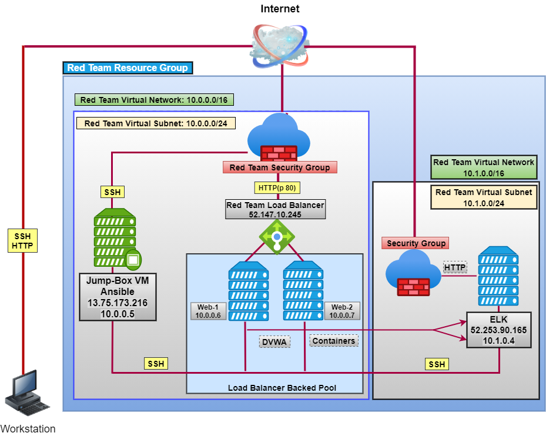

### Automated ELK Stack Deployment

The files in this repository were used to configure the network depicted below.

These files have been tested and used to generate a live ELK deployment on Azure. They can be used to either recreate the entire deployment pictured above. Alternatively, select portions of the yml and config file may be used to install only certain pieces of it, such as Filebeat.

  - _TODO: Enter the playbook file._

This document contains the following details:
- Description of the Topologu
- Access Policies
- ELK Configuration
  - Beats in Use
  - Machines Being Monitored
- How to Use the Ansible Build

### Description of the Topology

The main purpose of this network is to expose a load-balanced and monitored instance of DVWA, the D*mn Vulnerable Web Application.

Load balancing ensures that the application will be highly avaiable, in addition to restricting traffic to the network.
- What aspect of security do load balancers protect?
  - Answer: Avaiability, Web traffic, Web security
- What is the advantage of a jump box?
  - Answer: Automation, Security, Network Segmentation, Access Control

Integrating an ELK server allows users to easily monitor the vulnerable VMs for changes to the data and system logs.
- What does Filebeat watch for?
  - Filebeat monitors the log files or locations that you specify, collects log events, and forwards them either to Elasticsearch or Logstash for indexing.  
- What does Metricbeat record?
  - Metricbeat takes the metrics and statistics that it collects and ships them to the output that you specify, such as Elasticsearch or Logstash.

The configuration details of each machine may be found below.

|     Name      |    Function    | IP Address - Private | IP Address - Public | Operating System |
|---------------|----------------|----------------------|---------------------|------------------|
| Jump Box      | Gateway        | 10.0.0.5             | 13.75.173.216       | Linux            |
| Web-1         | Web server     | 10.0.0.6             | NIL                 | Linux            |
| Web-2         | Web server     | 10.0.0.7             | NIL                 | Linux            |
| ELK           | ELK server     | 10.1.0.4             | 52.253.90.165       | Linux            |
| Load balancer | Load balancer  | NIL                  | 52.147.10.245       | Linux            |
| Workstation   | Access control | NIL                  | External            | Linux            |

### Access Policies

The machines on the internal network are not exposed to the public Internet. 

Only the ELK Server machine can accept connections from the Internet. Access to this machine is only allowed from the following IP addresses:
- Public IP address 5601.120.21.6.228 through TCP 5601

Machines within the network can only be accessed by Jump box provisioner.
- Which machine did you allow to access your ELK VM? What was its IP address?
  - Jump box provisioner private IP address 10.0.0.5 - SSH port 22

A summary of the access policies in place can be found in the table below.

| Name          | Publicly Accessible | Allowed IP Addresses |
|---------------|---------------------|----------------------|
| Jump Box      | Yes                 |    13.75.173.216     |
| Web-1         | No                  |    N/A               |
| Web-2         | No                  |    N/A               |
| ELK Server    | YES                 |    52.253.90.165     | 
| Load balancer | YES                 |    52.147.10.245     |

### Elk Configuration

Ansible was used to automate configuration of the ELK machine. No configuration was performed manually, which is advantageous because...
- What is the main advantage of automating configuration with Ansible? 
  - Answer: Ansible lets us quickly and easily implement layers of apps. No need to write custom code to automate our systems; We list the tasks required to be done by
    writing a playbook, and Ansible will figure out how to get our systems to the state we want them to be in. 

The playbook implements the following tasks:
- _TODO: In 3-5 bullets, explain the steps of the ELK installation play. E.g., install Docker; download image; etc._
- ...
- ...

The following screenshot displays the result of running `docker ps` after successfully configuring the ELK instance.

### Target Machines & Beats
This ELK server is configured to monitor the following machines:
- _TODO: List the IP addresses of the machines you are monitoring_

We have installed the following Beats on these machines:
- _TODO: Specify which Beats you successfully installed_

These Beats allow us to collect the following information from each machine:
- _TODO: In 1-2 sentences, explain what kind of data each beat collects, and provide 1 example of what you expect to see. E.g., `Winlogbeat` collects Windows logs, which we use to track user logon events, etc._

### Using the Playbook
In order to use the playbook, you will need to have an Ansible control node already configured. Assuming you have such a control node provisioned: 

SSH into the control node and follow the steps below:
- Copy the _____ file to _____.
- Update the _____ file to include...
- Run the playbook, and navigate to ____ to check that the installation worked as expected.

_TODO: Answer the following questions to fill in the blanks:_
- _Which file is the playbook? Where do you copy it?_
- _Which file do you update to make Ansible run the playbook on a specific machine? How do I specify which machine to install the ELK server on versus which to install Filebeat on?_
- _Which URL do you navigate to in order to check that the ELK server is running?

_As a **Bonus**, provide the specific commands the user will need to run to download the playbook, update the files, etc._
